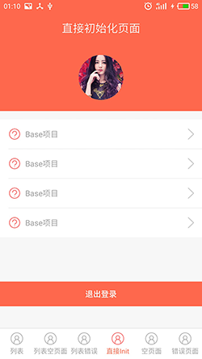

# MvvM结合Presenter快速开发框架
```sh
网络请求工具：OKGO
图片加载工具：Fresco、Glide
图片选择器：Matisse（知乎开源）
动态权限申请工具：Acp
Banner轮播图：BGABanner
上拉加载、下拉刷新控件：TwinklingRefreshLayout
RecyclerViewAdapter：BGABindingRecyclerViewAdapter
Eventbus：Eventbus3.0
```

### 数据成功列表页面


### 数据为空列表页面


### 网络出错列表页面


### 直接初始化页面（在网络请求之前）


### 空数据页面


### 网络出错页面

